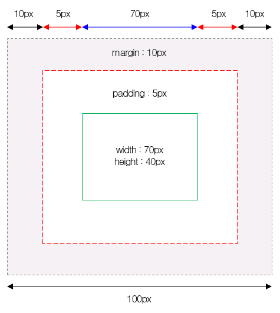

# Css Box Model 가이드

제작자 - UID팀 박솔사원

- - -

## Box Model이란?

모든 HTML 요소는 박스(box) 모양으로 구성되며, 이것을 박스 모델(box model)이라고 부른다.
박스 모델은 html 요소를 패딩(padding), 테두리(border), 마진(margin), 그리고 내용(content)으로 구분한다.

1. 내용(content) : 텍스트나 이미지가 들어있는 박스의 실질적인 내용 부분이다.

2. 패딩(padding) : 내용과 테두리 사이의 간격이다. 패딩은 눈에 보이지 않는다.

3. 테두리(border) : 내용와 패딩 주변을 감싸는 테두리이다.

4. 마진(margin) : 테두리와 이웃하는 요소 사이의 간격이다. 마진은 눈에 보이지 않는다.

- - -

## HTML 요소의 높이와 너비 구하기

위의 그림에서 전체 너비(width)를 계산해 보면,  
width(70px) + left margin(10px) + left padding(5px) + right padding(5px) + right margin(10px) = 100px 이 된다.

즉, HTML 요소의 전체 너비(width)를 계산하는 공식은  
width + left padding + right padding + left border + right border + left margin + right margin 이다.

또한, HTML 요소의 전체 높이(height)를 계산하는 공식은  
height + top padding + bottom padding + top border + bottom border + top margin + bottom margin 이다.

이때 마진(margin) 영역의 크기는 눈으로 바로 확인할 수는 없을 것이다.  
왜냐하면 마진이란 테두리(border)와 이웃하는 요소 사이의 간격이면서, 배경색의 영향을 받지 않기 때문이다.

하지만 HTML 요소가 차지하는 크기에는 포함된다.

- - -

## CSS 마진 상쇄(Margin-collapsing)

### **마진 상쇄란?**

흔히 마진 겹침 현상이라고도 불린다. 하지만 인과관계로 볼 때, 마진이 겹치게 되면 상쇄가 일어나기 때문에 영미권에서는 '마진 상쇄(Margin collapsing)'로 부르고 있다. 다음은 MDN 및 W3C의 마진 상쇄에 대한 설명이다.

    블록의 top 및 bottom 마진은 때로는 (결합되는 마진 중 크기가) 가장 큰 한 마진으로 결합(combine, 상쇄(collapsed))됩니다, 마진 상쇄(margin collapsing)로 알려진 행동
    -MDN

    In CSS, the adjoining margins of two or more boxes (which might or might not be siblings) can combine to form a single margin. Margins that combine this way are said to collapse, and the resulting combined margin is called a collapsed margin.
    -W3C

쉽게 말해, 마진 상쇄는 어떤 두 개 이상 블록 요소의 상하 마진이 겹칠 때 어느 한 쪽의 값만 적용하는 브라우저 나름의 렌더링 규칙 정도로 이해하면 될 것 같다.

여기서부터는 블록(block) 요소를 편의상 박스라고 부르겠다.

- - -

### **마진 상쇄가 일어나는 3가지 상황**

#### **1. 인접 형제 박스 간 상하 마진이 겹칠 때**

겹쳐진 두 마진 값을 비교해, 더 큰 마진 값으로 상쇄해 렌더링한다. 만약 겹쳐진 두 값이 동일할 경우, 중복을 상쇄해 렌더링한다.

#### **2. 빈 요소의 상하 마진이 겹칠 때**

'빈 요소' 란 높이(height)가 0인 상태의 블록 요소를 말한다.

- height / min-height / padding / border 등 상하로 늘어나는 프로퍼티 값을 명시적으로 주지 않았거나
- 내부에 Inline 콘텐츠가 존재하지 않는 요소

이 경우 위와 아래를 가르는 경계가 없으므로, 자신의 상단 마진의 값과 하단 마진의 값을 비교해 더 큰 값으로 상쇄한다. 만약 겹쳐진 두 값이 동일할 경우, 중복을 상쇄한다. 특히 빈 요소와 인접 박스들 간에 마진 겹침이 일어나는 구조에서는 다음과 같이 상쇄가 여러 번 발생하게 된다.

"그럼 빈 요소를 안 만들면 되지 않나?"라고 생각할지도 모르겠다. 하지만 마크업을 진행하다 보면 생각보다 많은 경우에 빈 요소를 만들어놓게 된다.

- 빠른 레이아웃 구성을 위해 div로 영역을 만들어 놓을 경우
- 내부에 요소를 append 하기 위해 빈 컨테이너를 만들어 놓을 경우 등

height, padding, border 등 높이와 관련된 속성들은 상위로부터 상속되지 않기 때문에, 위의 경우들을 위해서라도 꼭 인지해야 할 부분이라 생각한다.

#### **3. 부모 박스와 첫 번째(마지막) 자식 박스의 상단(하단) 마진이 겹칠 때**

마진이란 콘텐츠 간의 간격이고, 간격을 벌리기 위해서는 경계를 필요로 한다. 브라우저는 부모 박스와 첫 번째(마지막) 자식 박스 간의 경계를 그 사이에 있는 border / padding / inline 콘텐츠 유무로 판단한다. 앞에 설명했던 빈 박스의 마진 상쇄 현상과는 조금 다르게, 이미 명시적으로 height / min-height 값을 줬더라도 이번 경우에선 신경 쓰지 않는다.

따라서 부모와 첫 번째(마지막) 자식 사이에 inline 콘텐츠(텍스트 등)가 없거나, 상단(하단)에 명시적으로 padding 또는 border 값을 주지 않았다면 마진이 겹치게 됩니다. 이때, 자식 요소의 마진이 더 크든 작든 상관없이 상쇄된 마진은 부모 박스의 바깥으로만 렌더링이 됩니다.

**3-1. 부모 박스와 첫 번째 자식 박스의 상단 마진이 나란히 겹칠 때**

**3-2. 부모 박스와 마지막 자식 박스의 하단 마진이 나란히 겹칠 때**

상단 마진끼리 겹칠 때와 같은 원리이다. 예시 이미지 하나만 보겠다.

그래서  
다음과 같이 부모 박스 상단(하단)에 padding 또는 border 값을 주어 벽을 만들어주는 것이 안전하다. 이렇게 하면 의도했던 대로 첫 번째(마지막) 자식 요소를 배치할 수 있다.

- - -

### **마진 상쇄 규칙 적용**

- 마진 상쇄는 인접한 두 박스가 온전한 block-level 요소일 경우에만 적용된다.  
(inline, inline-block, table-cell, table-caption 등의 요소는 block-level이 아니다.)
- 마진 값이 0이더라도 상쇄 규칙은 적용된다.
- 좌우 마진은 겹치더라도 상쇄되지 않는다.

- - -

### **마진 상쇄 규칙 예외**

다음과 같은 상황에서는 인접 요소 간 마진 상쇄가 일어나지 않는다.

- 박스가 position: absolute 된 상태
- 박스가 float: left/right 된 상태 (단, clear 되지 않은 상태)
- 박스가 display: flex 일 때 내부 flexbox item
- 박스가 display: grid 일 때 내부 grid item

- - -

